#  Project #2: React Front End Application

## Technical Requirements
- **Build a web application**
- **Use React framework** to build your application with _at least_
  - 3 components
  - 4 props
  - 2 state properties
  - 2 setState
  - 2 routes
- **Use 3rd party API**
  - Make API call and display the data for the user.
- **Craft a README.md file** that explains your app
- **Create wireframes** for your app and include it in your repo/readme.
- **Use a CSS framework** like [TailwindCSS](https://tailwindcss.com/) and [Bootstrap](https://getbootstrap.com/) or a React component library like [Ant Design](https://ant.design/docs/react/introduce) and [Material UI](https://material-ui.com/).

## Idea
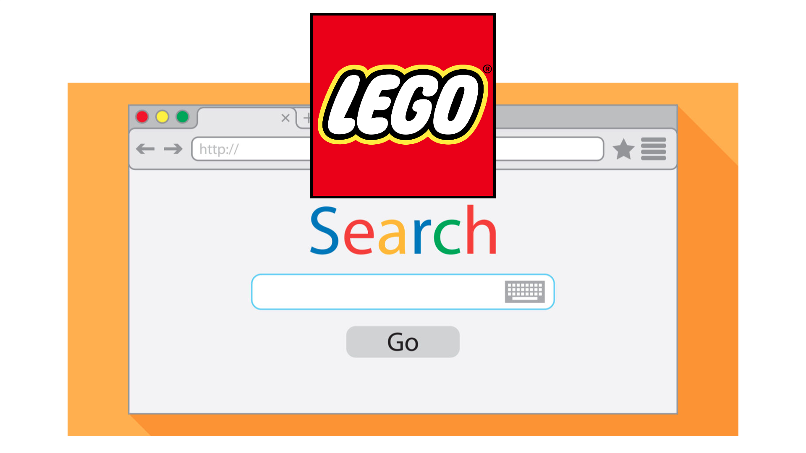

This web application allows users to search for LEGO sets and minifigures, view LEGO sets and minifigures information and collate their collection into an excel file.

## Live Version
View [LEGO Search.](https://legosearch.vercel.app/)

## API
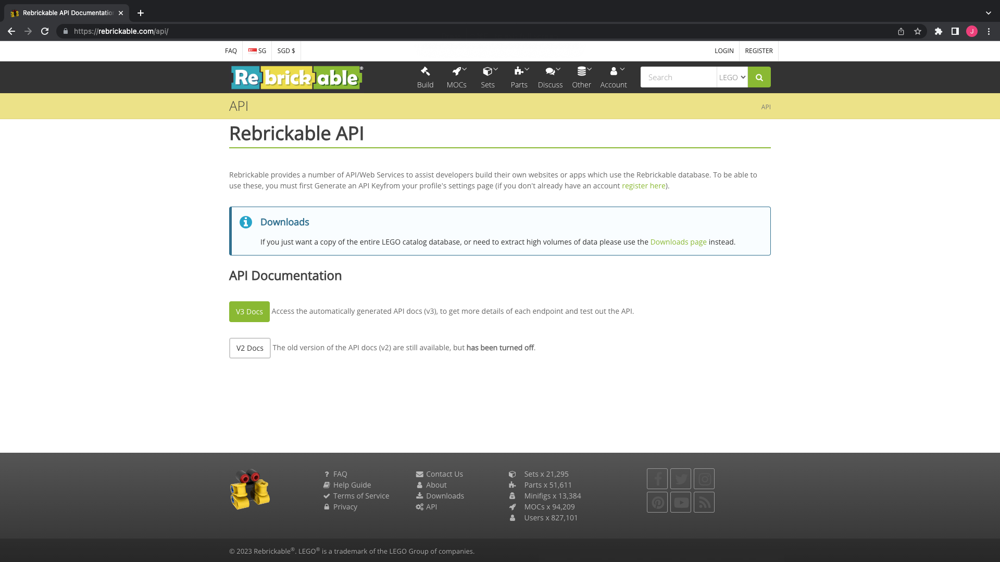

View [Rebrickable API.](https://rebrickable.com/api/)

## Copyrights
- All rights belong directly to their rightful owners. No copyright infringement intended.

## Wire Frame
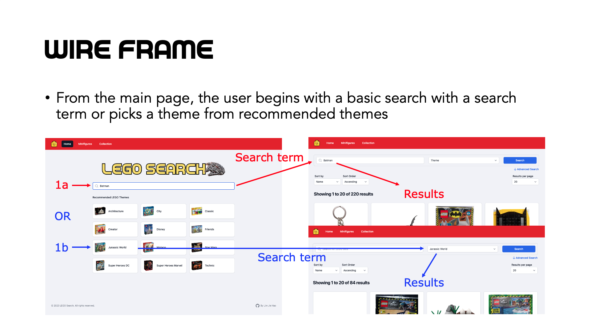
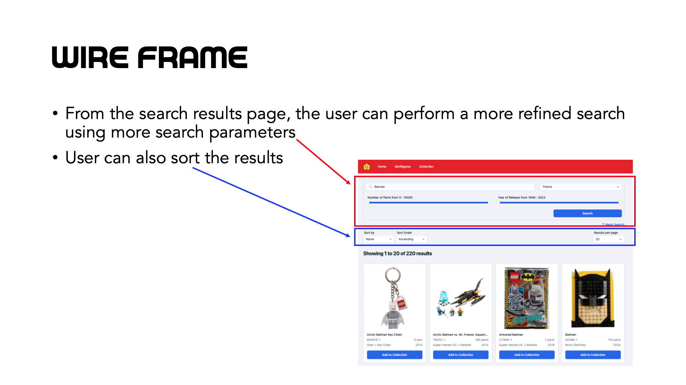
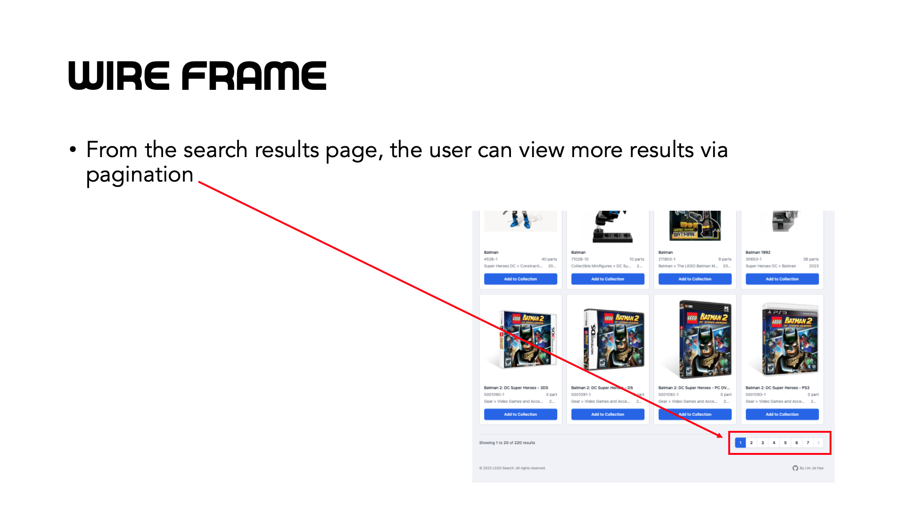
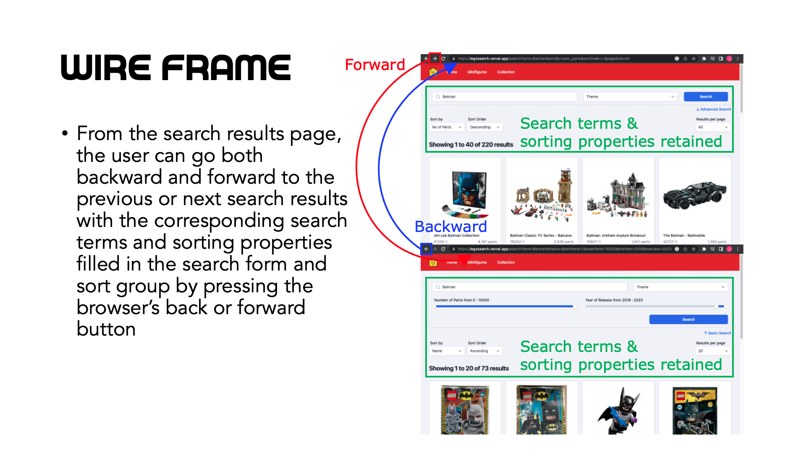
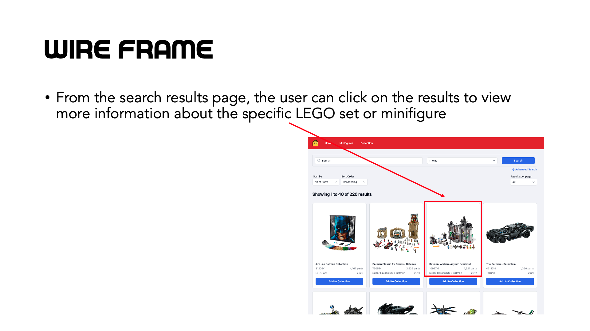
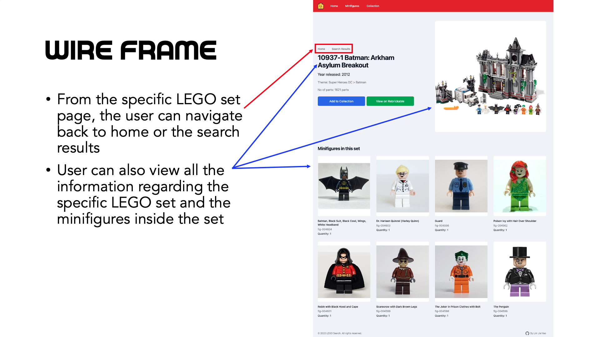
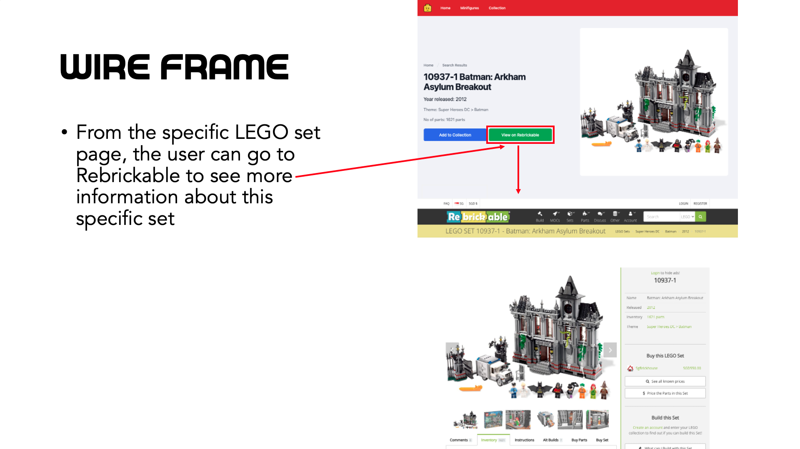
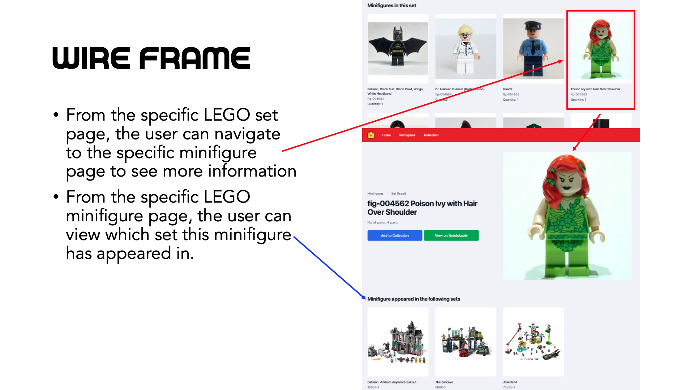
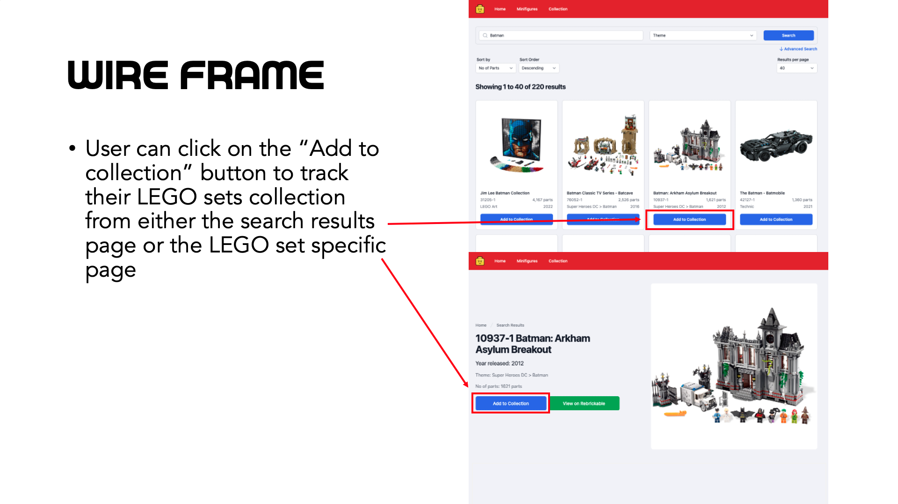
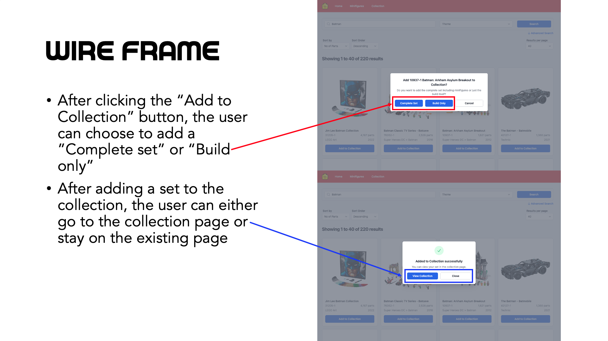
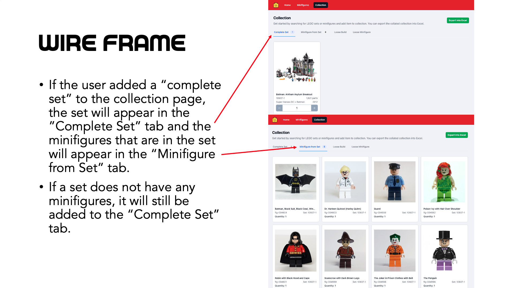
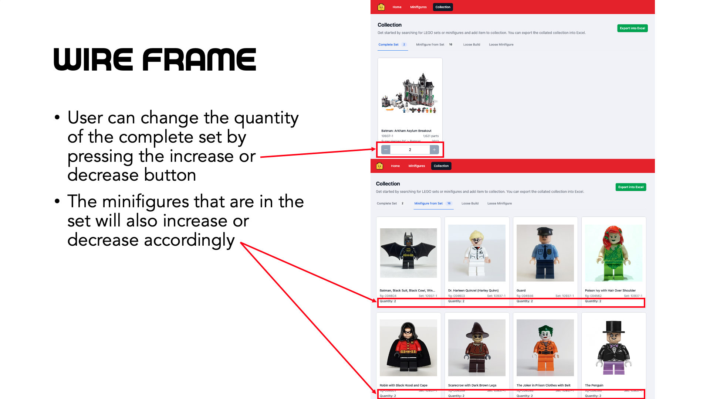
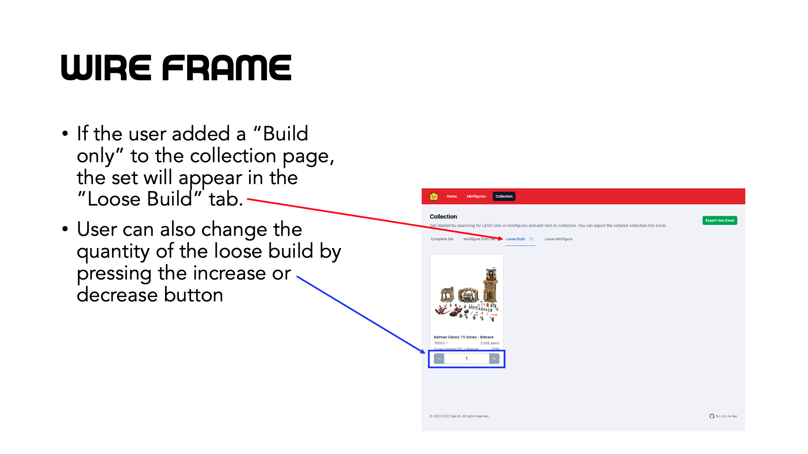
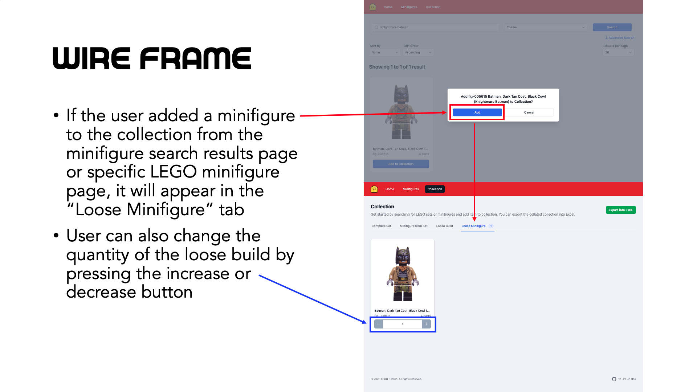
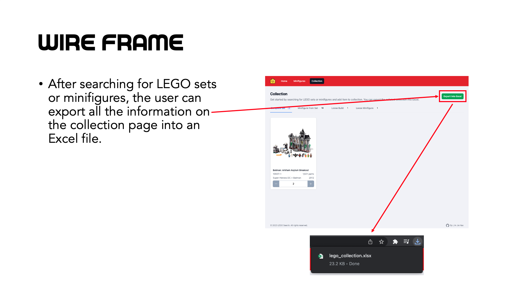

# Code
## Technologies and Tools used
- HTML
- CSS
- Javascript
- ReactJS
- Tailwind CSS
- Tailwind UI
- Heroicons
- Headless UI
- Toolcool range slider
- SheetJS
- Git and GitHub

## Wire Frame
View [flowchart at Miro.](https://miro.com/app/board/uXjVPccHgUw=/?share_link_id=161052720807)

## HTML Structure

## CSS Properties

## Javascript and jQuery Code Organisation
The code is organised into five categories as follows:
1. Objects to track game items and the user's progress
2. General functions that are repeatedly used in other functions
3. Display functions to generate different screens
4. Event listener functions on game screens
5. Game flow functions to update the game progress

## Javascript and jQuery Code Structure
Most of the codes are structured in the following manner except for customized code required in different screens/modals/event listeners:

## Learning and Improvement Points
1. Learned and discovered that general functions can be written to shorten code. For example, the $generateHTMLElement function allows me to generate HTML elements more efficiently instead of coding jQuery line by line.

2. Learned how to use local storage to store high scores.

3. CSS class and id naming convention can be confusing. This causes time to be wasted when coding and can be improved with better planning.
4. Current app is mostly responsive to other screen sizes, but it can be even more responsive since some of the CSS properties are in px instead of em/rem.
5. Game can be improved by implementing more game settings, e.g. adjusting the timer per round or adjusting the difficulty of the questions.
6. Game can have more CSS animation to make the game even more "alive".

## References and Inspirations
- [W3Schools for the modal](https://www.w3schools.com/howto/tryit.asp?filename=tryhow_css_modal2)
- [Codegrepper for the blinking CSS effect](https://www.codegrepper.com/code-examples/css/how+to+make+a+box+blink+in+css)
- [Code Boxx for the rainbow CSS effect](https://code-boxx.com/create-rainbow-text-pure-css-js/)
- [Deviant Art for the WWBM logo](https://www.deviantart.com/zackthetimelordrblx/art/Who-Wants-To-Be-a-Millionaire-UK-2018-logo-remake-762595559)
- [Imgur for the lifelines icons picture](https://imgur.com/sQvoOhJ)
- [Khinsider for the WWBM soundtrack](https://downloads.khinsider.com/game-soundtracks/album/who-wants-to-be-a-millionaire-the-album)
- [TheGuardian.com for the trial question list](https://www.theguardian.com/tv-and-radio/ng-interactive/2020/sep/12/who-wants-to-be-a-millionaire-jackpot-questions-quiz-yourself)
- [The Trivia API for the list of questions](https://the-trivia-api.com/search/)