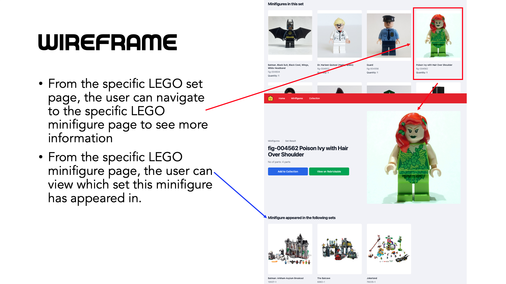

#  Project #2: React Front End Application

## Technical Requirements
- **Build a web application**
- **Use React framework** to build your application with _at least_
  - 3 components
  - 4 props
  - 2 state properties
  - 2 setState
  - 2 routes
- **Use 3rd party API**
  - Make API call and display the data for the user.
- **Craft a README.md file** that explains your app
- **Create wireframes** for your app and include it in your repo/readme.
- **Use a CSS framework** like TailwindCSS, Bootstrap, a React component library like Ant Design oe Material UI.

## Idea

This web application allows users to search for LEGO sets and minifigures, view LEGO sets and minifigures information and collate their collection into an Excel file.

## Live Version
View [LEGO Search.](https://legosearch.vercel.app/)

## API

View [Rebrickable API.](https://rebrickable.com/api/)

## Copyrights
- All rights belong directly to their rightful owners. No copyright infringement intended.

## Wireframe

# Code
## Technologies and Tools used
- HTML
- CSS
- Javascript
- ReactJS
- Tailwind CSS
- Tailwind UI
- Heroicons
- Headless UI
- Tool Cool Range Slider
- SheetJS
- Git and GitHub

## React Hook used
- useEffect
- useRef
- useState
- useLocation
- useNavigate
- useOutletContext
- useParams
- useSearchParams

## Search Results Page Flowchart
View [flowchart at Miro.](https://miro.com/app/board/uXjVM-kNemg=/?share_link_id=189162665912)

## Learning Points
1. Learned to use try, throw and catch statements.

2. Learned the importance of data structures. It allows the program to store and process data effectively.

3. Learned to use and build customized components from the existing TailwindCSS component library framework.
4. Learned how to use Tool Cool Range Slider and SheetJS.
5. Learned to make multiple API call with async and await functions.
6. Learned and practised data manipulation and also used javascript functions like map, filter and reduce.

## References and Inspirations
- [Tailwind CSS for the documentation](https://tailwindcss.com/)
- [Tailwind UI for the react components](https://tailwindui.com/)
- [Tool Cool Range Slider for the documentation](https://toolcool-range-slider.mzsoft.org/)
- [SheetJS for the documentation](https://sheetjs.com/)
- [Rebrickable for the API](https://rebrickable.com/api/)
- [LEGO for the images](https://www.lego.com/en-sg)
- [No image available image](https://upload.wikimedia.org/wikipedia/commons/thumb/6/65/No-Image-Placeholder.svg/1200px-No-Image-Placeholder.svg.png)
- [LEGO Smiley Face image](https://www.pinterest.com/pin/lego-face-wallpaper--295548794274755120/)
- [Search Engine Journal for the image]( https://www.searchenginejournal.com/wp-content/uploads/2021/08/great-search-engines-612f8f78d1f79-sej-1280x720.jpg)
- [Google Search for the design inspiration](https://www.google.com)
